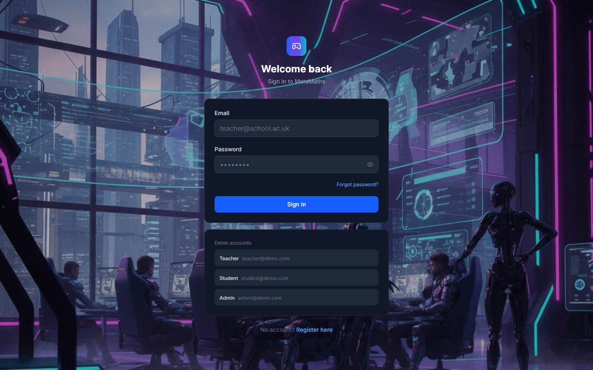
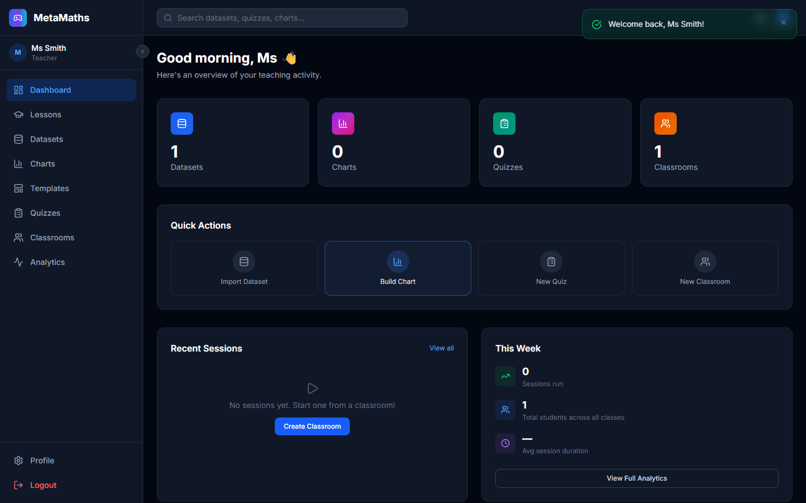
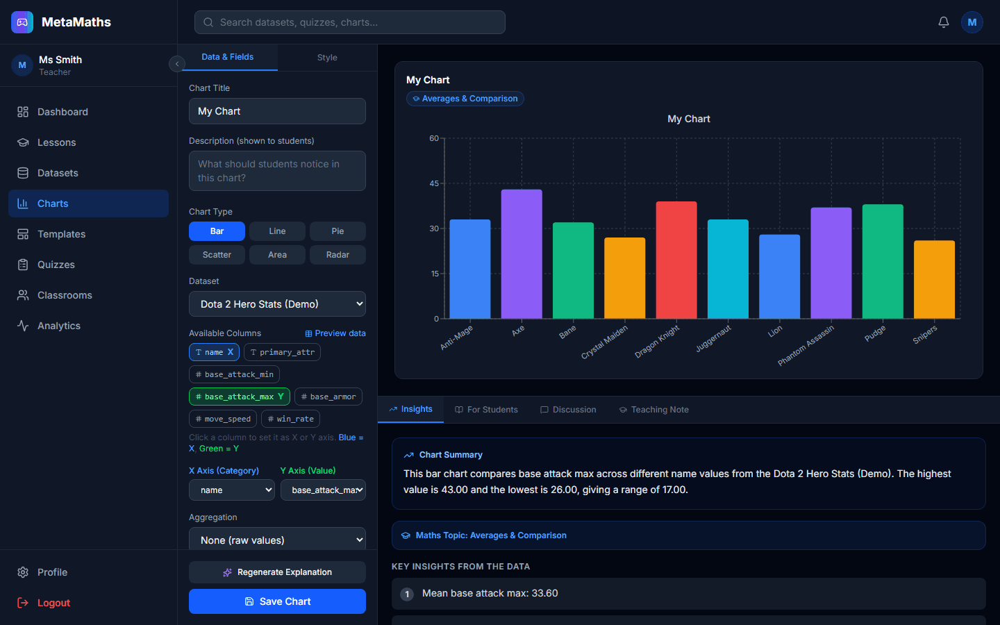
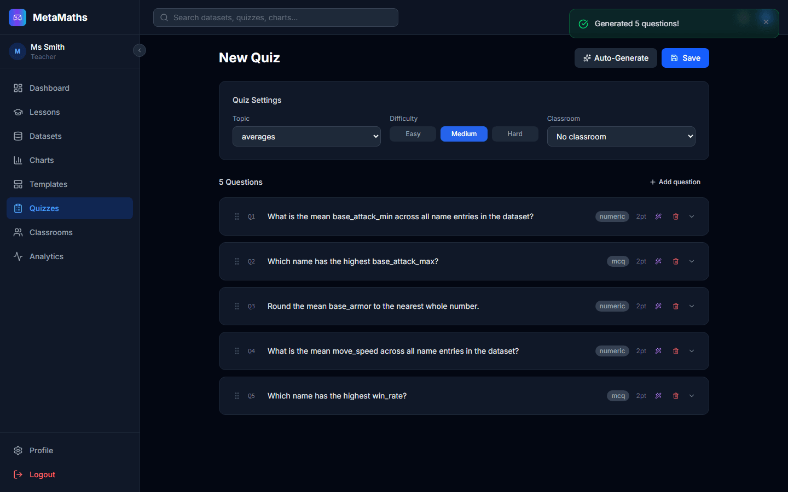
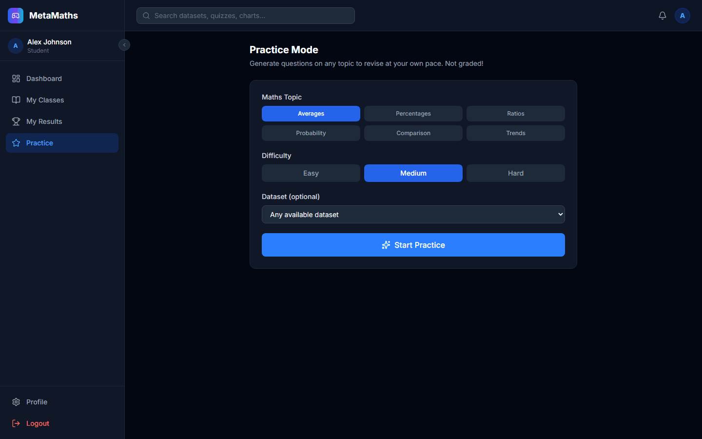

# MetaMaths

**Live app:** [meta-maths.vercel.app](https://meta-maths.vercel.app)

**A full-stack classroom platform that teaches secondary-school maths through real esports data.**

Instead of dry textbook problems, students answer maths questions generated from real-world data — League of Legends champion stats, Dota 2 hero win rates, CS2 match results, and more. Teachers import datasets, build charts, auto-generate quizzes, and run live classroom sessions for 30+ students with a real-time leaderboard.



## Why

Secondary school maths teachers struggle to engage students with abstract numerical concepts, and raw spreadsheet access is uncontrolled and risky to hand out in a classroom. MetaMaths gives teachers a safe, purpose-built workflow: curate esports data → turn it into charts and quizzes → run it live in front of the class.

| Feature | What it does |
|---|---|
| **Controlled data access** | Students see charts and questions — never raw spreadsheet rows |
| **Auto question generation** | A rule-based engine derives valid maths questions from any dataset |
| **Live sessions** | Real-time Socket.IO sessions for 30+ students with a live leaderboard |
| **AI enhancement** | Gemini/Claude rephrase questions and explain charts — never compute the answer |
| **Multi-role system** | Admin, Teacher, and Student each get a tailored dashboard |
| **Automated emails** | Registration, session start, results, and other transactional emails |

## Screenshots

| Teacher dashboard | Chart builder |
|---|---|
|  |  |

| Auto-generated quiz | Student practice mode |
|---|---|
|  |  |

The chart builder generates a live AI explanation of the data alongside the visualisation; the quiz builder can auto-generate a full set of questions — numeric and multiple-choice — straight from the selected dataset.

## Tech Stack

**Frontend** — React 18 · Vite · Tailwind CSS v4 · TanStack Query · Zustand · React Hook Form + Zod · Recharts · Socket.IO Client

**Backend** — Node.js · Express · Prisma ORM · PostgreSQL · Redis · Socket.IO · BullMQ

**AI / Integrations** — Anthropic Claude & Google Gemini (question rephrasing, chart explanations) · OpenDota & PandaScore APIs (esports data) · Google Drive OAuth (dataset import) · Nodemailer (transactional email)

## Architecture

```
                     USER'S BROWSER
   React SPA (port 5173)    │    Socket.IO WebSocket
                  │              │
             Vite Dev Server (port 5173)
        Proxy: /api/*      → localhost:3001
        Proxy: /socket.io/* → localhost:3001 (ws)
                             │
             Node.js / Express API (port 3001)
   Helmet → CORS → JSON → Cookie → Rate Limit → JWT Auth → RBAC → Zod
   Modules: auth, datasets, charts, quizzes, classrooms,
            sessions, analytics, admin, notifications, llm
   Socket.IO /sessions namespace
                  │          │          │
            PostgreSQL    Redis     External APIs
            (data)       (pub/sub)  OpenDota / PandaScore
                                    Riot / Drive / Gemini / SMTP
```

The frontend and backend run as two separate processes in development; Vite proxies `/api/*` and `/socket.io/*` so the browser only ever talks to one origin.

## Getting Started

### Prerequisites
Node.js 18+, Docker (for PostgreSQL + Redis)

### 1. Start PostgreSQL + Redis
```bash
docker-compose up -d
```

### 2. Backend
```bash
cd server
cp .env.example .env      # fill in JWT secrets, SMTP/API keys as needed
npm install
npx prisma migrate dev
node src/db/seed.js
npm run dev                # http://localhost:3001
```

### 3. Frontend
```bash
# from repo root
npm install
npm run dev                # http://localhost:5173
```

### Demo accounts (after seeding)
| Role | Email | Password |
|------|-------|----------|
| Admin | admin@demo.com | demo1234 |
| Teacher | teacher@demo.com | demo1234 |
| Student | student@demo.com | demo1234 |

## Deployment

**Frontend on Vercel · Backend on Render · Database on Neon · Cache/queue on Upstash Redis** — all redeploy automatically on push to `main`.

1. **Neon** — create a Postgres project, copy the **pooled** connection string (`...-pooler...?sslmode=require`).
2. **Upstash** — create a Redis database, copy the `rediss://` TLS URL.
3. **Render** — New → Blueprint, point at this repo (uses [render.yaml](render.yaml)); fill in `DATABASE_URL`, `REDIS_URL`, `JWT_SECRET`, `JWT_REFRESH_SECRET`, `FRONTEND_URL` (your Vercel URL), plus any optional API keys. Render runs `prisma migrate deploy` on every deploy. The Free plan is enough — no card required.
4. **Vercel** — Import the repo (uses [vercel.json](vercel.json)); set `VITE_API_URL` to your Render service URL (e.g. `https://metamaths-api.onrender.com`, no trailing slash).
5. Once both URLs are known, update `FRONTEND_URL` on Render and `VITE_API_URL` on Vercel to point at each other exactly (full scheme, no trailing slash), then redeploy both.
6. **Seed demo data** (one-time) — the Render Free plan has no Shell/SSH access, so run the seed script from your own machine against the live Neon database instead:
   ```bash
   cd server
   DATABASE_URL="<neon-pooled-connection-string>" node src/db/seed.js
   ```
   The script is idempotent (safe to re-run). Demo accounts: `admin@demo.com` / `teacher@demo.com` / `student@demo.com`, password `demo1234`.

### Gotchas

- **`VITE_API_URL` is baked in at build time** (Vite inlines env vars into the bundle). Changing it in Vercel's dashboard does nothing until you trigger a new deployment.
- **`FRONTEND_URL` must exactly match** the browser's origin (scheme + host, no trailing slash) or the backend's CORS response won't match the request origin and the browser silently blocks it — logins will look like "invalid credentials" even though the request succeeded server-side.
- **Refresh-token cookie uses `sameSite: 'none'` in production** ([auth.routes.js](server/src/modules/auth/auth.routes.js)) since the frontend and backend are on different domains; this requires `secure: true`, which requires HTTPS (both Vercel and Render provide this by default).
- **Render's free instance spins down after 15 min idle** — the first request after a period of inactivity can take 30-60s to respond.

## Key Engineering Decisions

- **Controlled data layer** — students never query datasets directly; every chart/question is pre-computed server-side from teacher-curated data, removing an entire class of data-exposure risk.
- **Rule-based question generation** — questions are derived deterministically from dataset statistics (mean, max, comparisons) so every generated question has a guaranteed-correct answer, with an LLM used only to rephrase wording afterwards.
- **Socket.IO + Redis adapter** — live sessions scale horizontally across server instances by pub/subbing session state through Redis rather than holding it in process memory.
- **JWT auth + RBAC middleware** — role checks (`admin` / `teacher` / `student`) are enforced at the route layer via Express middleware, not in component logic.

## Project Structure

```
MetaMaths/
├── src/                  # React frontend
│   ├── pages/            # Route-level views (teacher/student/admin)
│   ├── features/         # Feature-scoped components & hooks
│   ├── components/       # Shared UI components
│   └── store/            # Zustand stores (auth, UI)
└── server/               # Express backend
    ├── src/modules/      # auth, datasets, charts, quizzes, classrooms, sessions, analytics...
    ├── src/realtime/     # Socket.IO live-session logic
    └── prisma/           # Schema & migrations
```

Full technical write-up — database design, auth flow, the question-generation engine, and the live-session protocol — is in [PROJECT_DOCUMENTATION.md](PROJECT_DOCUMENTATION.md).

## Author

**Prajwal Kateel** — [GitHub](https://github.com/prajwalkateel0)
